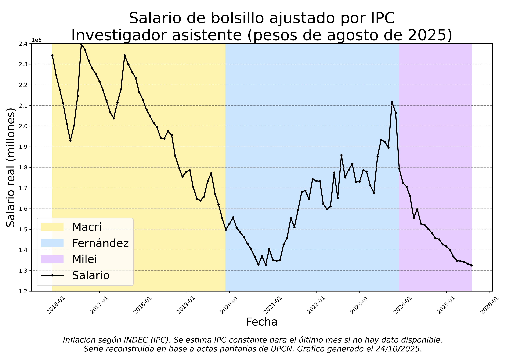
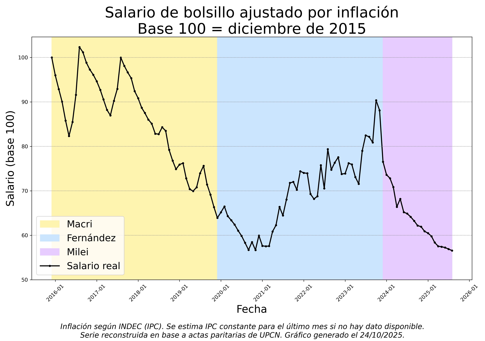
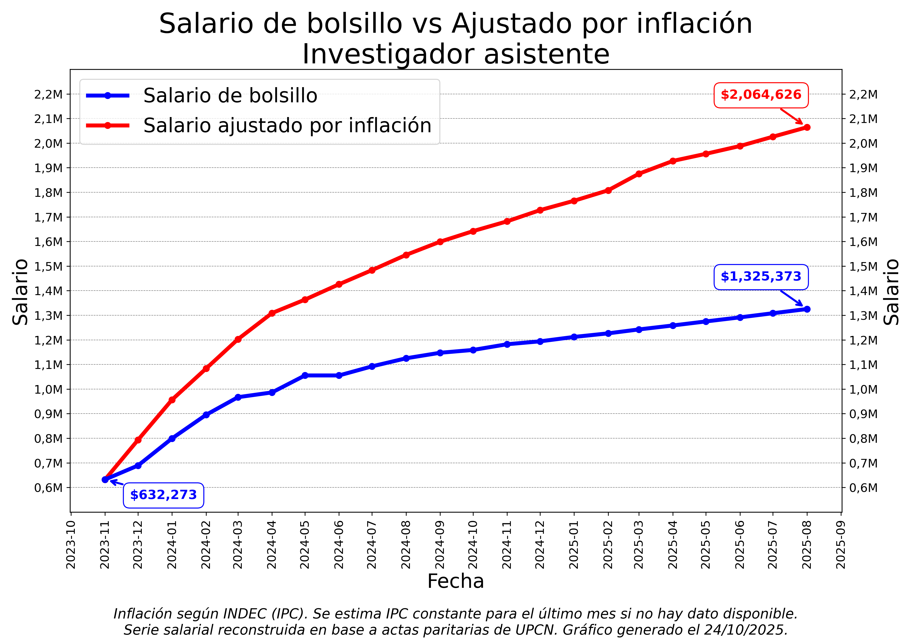
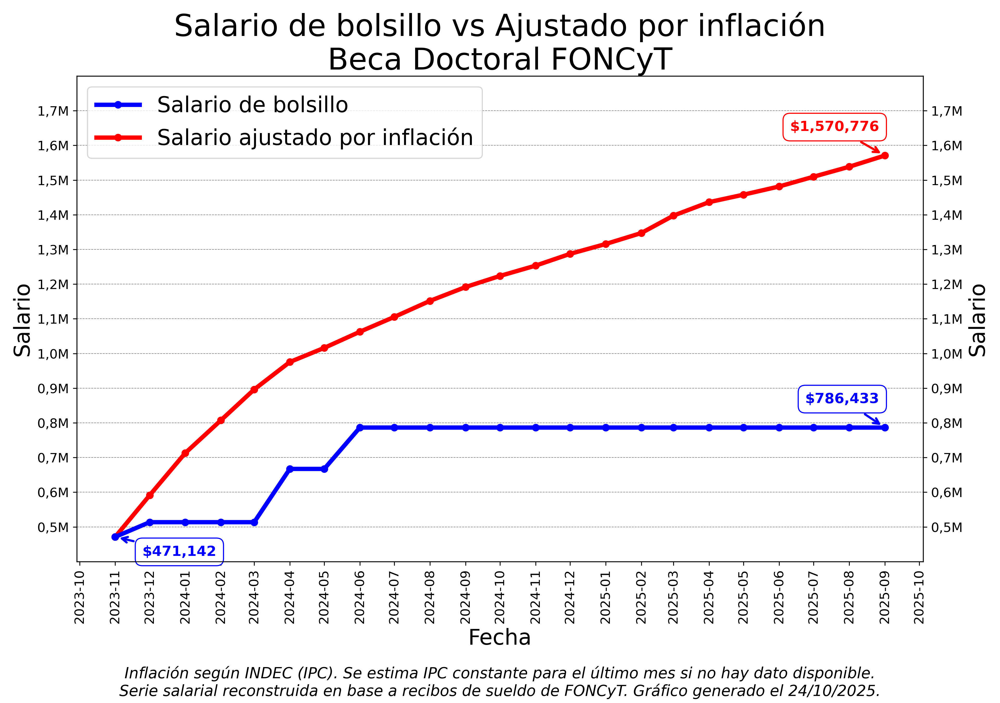
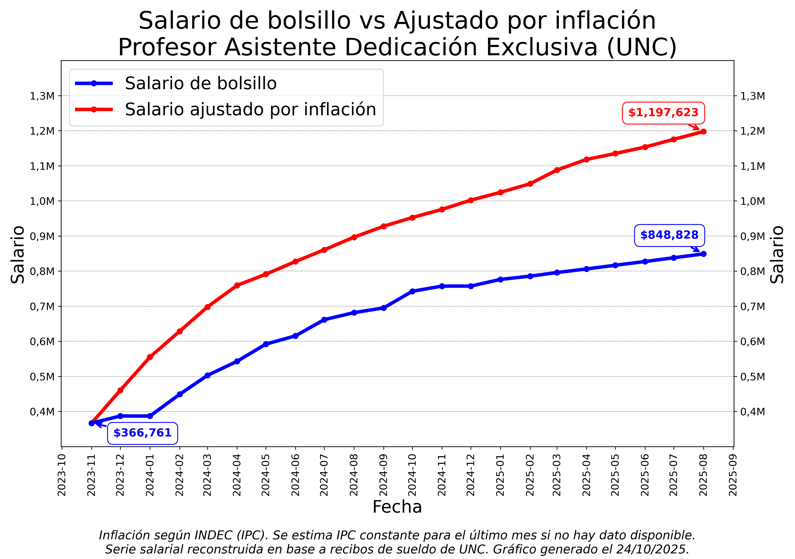

# Salarios CONICET y Universitarios

Este proyecto consta de dos scripts de Python.

1- "actualiza_datos.py" toma los datos crudos de inflacion (IPC INDEC) y salarios de la carpeta "datos", procesa esa información, ajusta por inflación y genera los datos procesados que se guardan en la carpeta "datos".
2- "graf_cic.py" toma esos datos y genera una serie de gráficos en la carpeta `plots`. Los gráficos representan visualizaciones de salarios históricos ajustados por inflación para diferentes categorías de investigadores, becarios doctorales y también profesores asistentes con dedicación exclusiva para la Universidad Nacional de Córdoba.

## Contenido de la Carpeta `plots`

La carpeta `plots` contiene los siguientes gráficos:

1. **Gráfico de Salario Real CONICET**: Evolución del salario real de investigadores asistentes de CONICET (ajustado por inflación, en equivalente a pesos del último mes) de investigadores asistentes CONICET. 

2. **Gráfico Salario CONICET Base 100**: Evolución del salario real tomando como base diciembre 2015. 

3. **Comparativa Salario Investigador asistente**: Salario nominal vs ajustado por inflación para investigadores asistentes. 

4. **Comparativa Estipendio Doctoral CONICET**: Salario nominal vs ajustado por inflación para becarios doctorales CONICET. 

4. **Comparativa Estipendio Doctoral FONCYT**: Salario nominal vs ajustado por inflación para becarios doctorales FONCyT.

6. **Comparativa Profesor Asistente**: Salario nominal vs ajustado por inflación para profesores asistentes dedicación exclusiva (DE). 

## Notas Adicionales

- Los salarios están ajustados a pesos de junio/2025 usando el IPC (INDEC).
- Las series se reconstruyeron usando diversas fuentes oficiales (actas paritarias, recibos de sueldo).
- Los gráficos incluyen períodos presidenciales marcados con diferentes colores de fondo.

Si tienes preguntas o necesitas más información sobre la metodología utilizada, no dudes en abrir un issue en este repositorio.